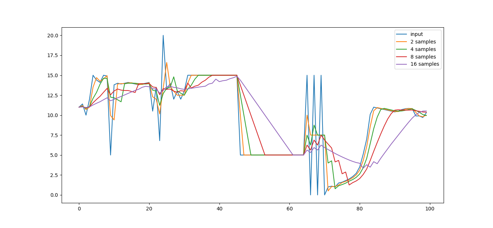
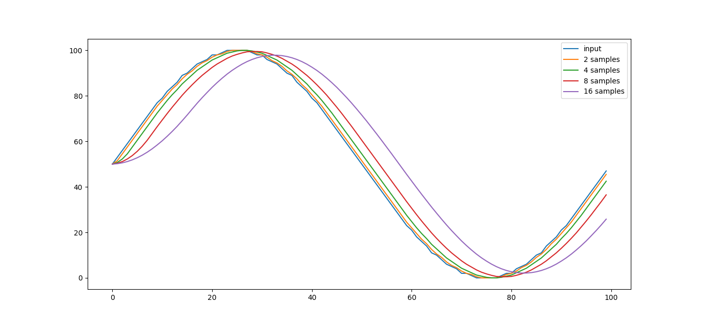
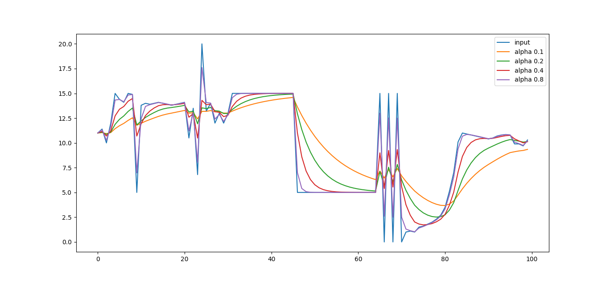
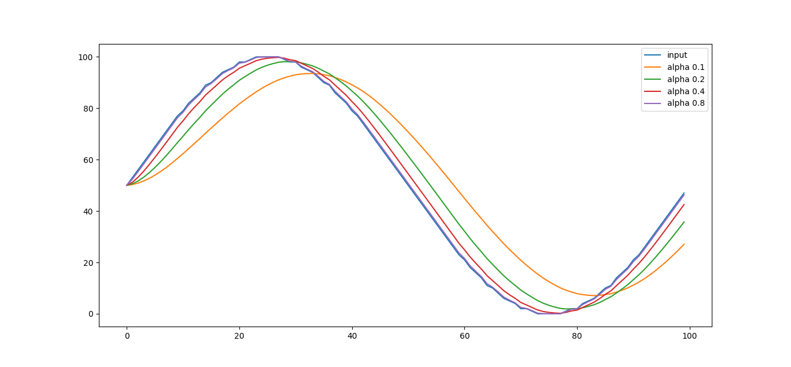
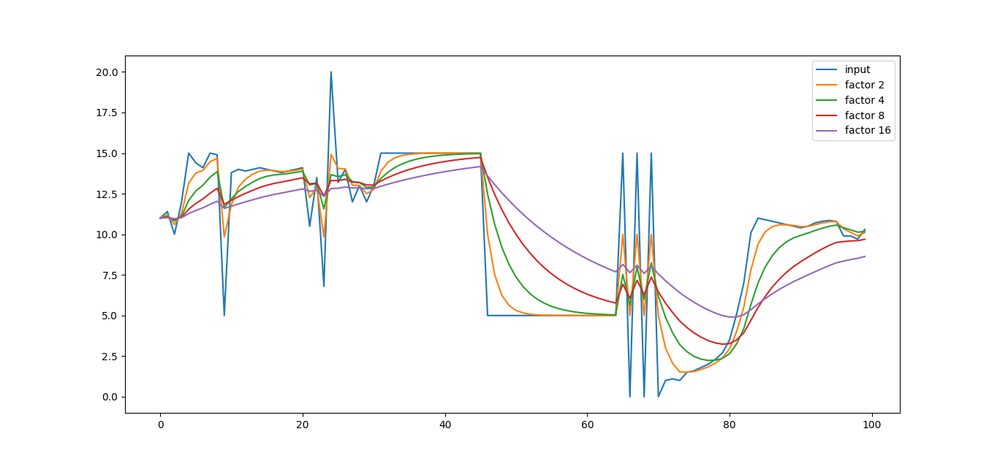
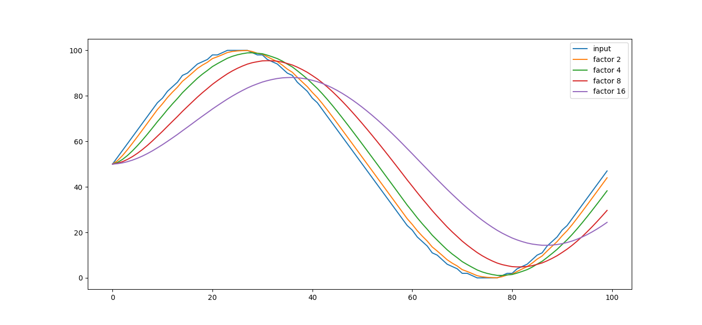

# A simple filter library written in micro python for use in microcontrollers like esp8266, esp32.

The [filters.py](filters.py) library contains three types of filters:
- Average filter
- EWMA filter
- IIR filter

## Usage
Model of operation of filter functions: the first call to the **NAME_filter** function returns the value given as the input parameter **input**.
This value is also stored for the next calculations for the next calls of this function.
Next calls of this function continue calculations for **input** data for previously set filter parameters or defaults values (if parameters are not set).
Using the **NAME_filter_reset** function returns this state to the beginning.

## Average filter

```
average_filter_reset(nums=1)
```
Function resets the filter to initial state with optional parameter **nums** (if omnitet then default set 1 samples average calculation).

```
average_set_samples(nums)
```
The function sets the number of data samples for which the mathematical mean will be calculated. **nums** must be greather or equal 1.

```
average_filter(input)
```
The function returns the calculated value for the given **input** data.

### Graphical representation of Average filter working

How the **nums** of samples parameter affects the output.

X axis - number of data sample

Y axis - data value





### Graphical representation of EWMA filter working

How the **alpha** parameter affects the output.

X axis - number of data sample

Y axis - data value





### Graphical representation of IIR filter working

How the **factor** parameter affects the output.

X axis - number of data sample

Y axis - data value




