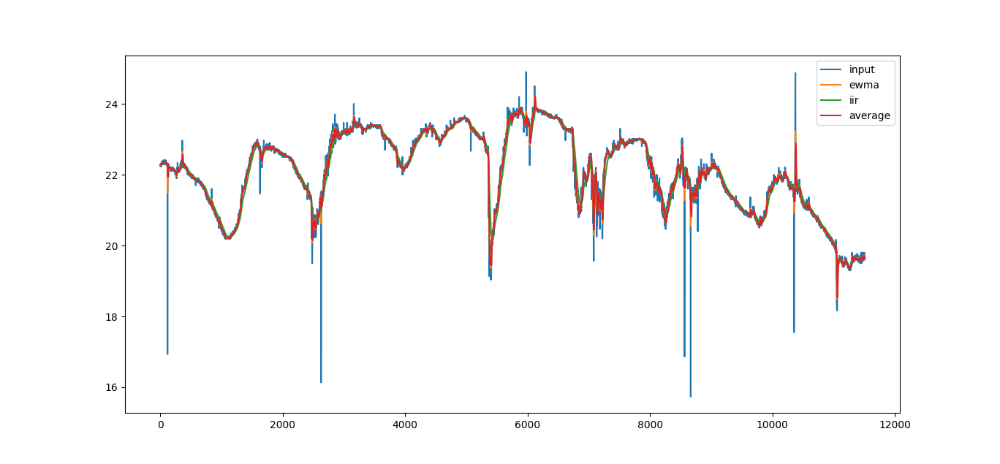
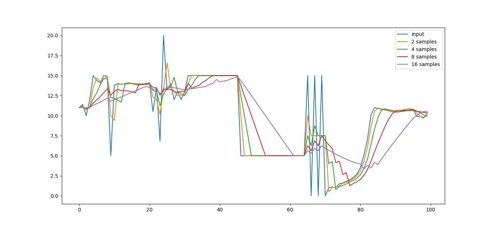

# Examples for filters python library

Examples are written in Python and use externall **matplotlib** library.
Due to the lack of an appropriate graphical interface and limited memory, these examples cannot be run on a microcontroller.

## [example_1.py](example_1.py)

This example program use filters on downloaded all historical pin data from Blynk. Downloaded historical data was stored in **.csv** file
The downloaded data is parsed, filtered and presented graphically in the form of a graph.

## [example_2.py](example_2.py)

This example program use filters on sample data stored in [data.py](data.py).
File contains a tables with preset sample data.
This data is filtered and presented graphically.

